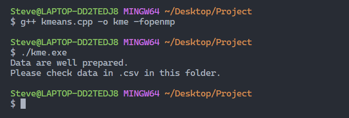

## Instruction

### 主程序编译

打开当前文件夹下terminal，输入：

```c++
g++ kmeans.cpp -o kme -fopenmp
./kme.exe
```

或直接运行现有程序：

```c++
./kme.exe
```

效果如图：



### 生成点云

建议使用linux系统进入matplotlib-cpp-master文件夹，编译main.cpp，编译命令：

```c++
g++ main.cpp -o result -I /usr/include/python3.8 -lpython3.8
```

参考链接：https://www.youtube.com/watch?v=OlbtdOAWNf8&list=PLpuSZdJt0dKW8Rk0OPca3TXvAxd7bwJwq&index=2

## 文件描述

1. python_verification是基于points.csv中数据，用python中的K-means包验证的
2. figure1 figure2 是点云生成图
3. points.csv和clusters.csv是聚类结果
4. matplotlib_cpp是画图用的库